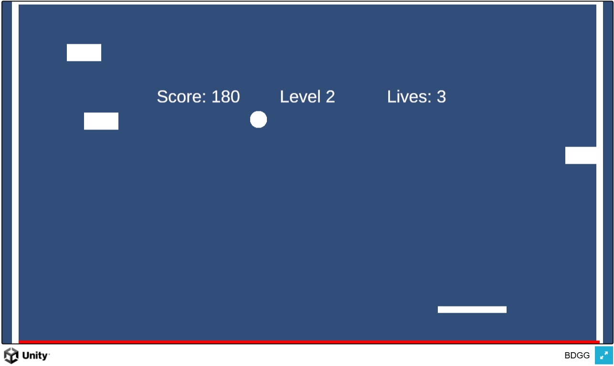

# BDGG (벽돌깨기)

BDGG는 Unity로 만든 간단한 벽돌깨기 게임입니다.

## [🎮 게임 플레이하기](https://hojun313.github.io/BDGG/)

## 게임 방법

-   **공**을 튕겨 화면 위의 **벽돌**을 모두 부수면 승리합니다.
-   방향키를 통해 **패들**을 좌우로 움직일 수 있습니다.
-   바닥으로 공을 떨어트리면 목숨이 줄어들며 목숨이 다하면 게임오버합니다.

## 개발

-   **엔진:** Unity
-   **플랫폼:** WebGL

---